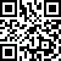
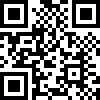

# QR code formats

Snabble supports online payments as well as a transmission of a shopping cart to the retailers cash desk.
For the transmission, the following QR-Codes formats are supported out of the box.


# Encoded Codes
With the encoded Codes QR-Code, all EANs are written into one QR-Code. By default, the EANs are separated by
a newline, so the code contains the EANS line by line.

Example: One *Duplo (40084015)* and two glasses of *Nutella (4008400401621)*.

With default formating:
```
0000040084015
4008400401621
4008400401621
```


For each project on the snabble platform, a different
set of delimiters and other paramters for the QR-Code can be configured.
Formating Parameters:

| Name      | Default         | Description                                          |
|-----------|-----------------|------------------------------------------------------|
| prefix    | ""              | The string at the beginning of the QR-Code.          |
| separator | "\n"            | The separator string between two EANS.               |
| suffix    | ""              | A string at the end of the QR code.                  |
| maxCodes  | 100             | Maximun number of EANs to fit into a single QR-Code. |

The above example with prefix and delimiter: "XE" and suffix: "XZ" will result in the following code:
```
XE0000040084015XE4008400401621XE4008400401621XZ
```




# QrCodePOS

With this format, the QR-Code just contains the ID of the checkout process.
The cash register is than able to fetch the shopping cart from the snabble POS service, using this id.
