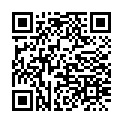
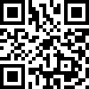
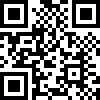

# QR code formats

Snabble supports online payments as well as transmission of a shopping cart to the retailer's cash desk.
For this transmission, the following QR code formats are supported out of the box.

## 1. QrCodePOS

With this format, the QR code just contains the ID of the checkout process.
The cash register is then able to fetch the shopping cart from the snabble POS service, using this id. The API for communication with the POS service is documented here:

[POS Integration API](api_pos_integration.md)


## 2. Scanned codes with quantities

All scanned codes are written into one QR code in a CSV-style (semicolon-separated) format. Each line consists of a quantity and the scanned code of the product, and a header line allows easy detection of this format. For example, one *Duplo (40084015)* and two glasses of *Nutella (4008400401621)* would be encoded as:

````
snabble;1;1
1;40084015
2;4008400401621
````

Lines are separated by a single newline character `\n`. The first line always starts with the character sequence `snabble;`, followed by two integer values, `N` and `M`. The value `M` specifies the total number of QR codes that need to be scanned by the cash register to read the complete purchase, in case it does not fit into a single code. The value `N` specifies the number of this QR code within the series of codes. For example, a single QR code will start with the header line `snabble;1;1`, and two codes would have the headers `snabble;1;2` and `snabble;2;2`, respectively. 



For each project on the snabble platform, a different set of delimiters and other parameters for the QR code can be configured. The available formatting parameters for this encoding are:

| Name      | Default         | Description                                           |
|-----------|-----------------|-------------------------------------------------------|
| maxCodes  | 100             | Maximum number of lines to fit into a single QR code. |

## 3. Repetitions of scanned codes

With this encoding, all scanned codes are written into one QR code as if they were scanned one-by-one. By default, the scanned codes are separated by a newline character, so the code contains the codes line by line.

Example: One *Duplo (40084015)* and two glasses of *Nutella (4008400401621)*.

With default formating:

```
0000040084015
4008400401621
4008400401621
```



For each project on the snabble platform, a different set of delimiters and other parameters for the QR code can be configured. The available formatting parameters for this encoding are:

| Name      | Default         | Description                                           |
|-----------|-----------------|-------------------------------------------------------|
| prefix    | ""              | The string at the beginning of the QR code.           |
| separator | "\n"            | The separator string between two scanned codes.       |
| suffix    | ""              | A string at the end of the QR code.                   |
| maxCodes  | 100             | Maximum number of codes to fit into a single QR code. |

The above example with prefix and delimiter: "XE" and suffix: "XZ" will result in the following code:

```
XE0000040084015XE4008400401621XE4008400401621XZ
```




